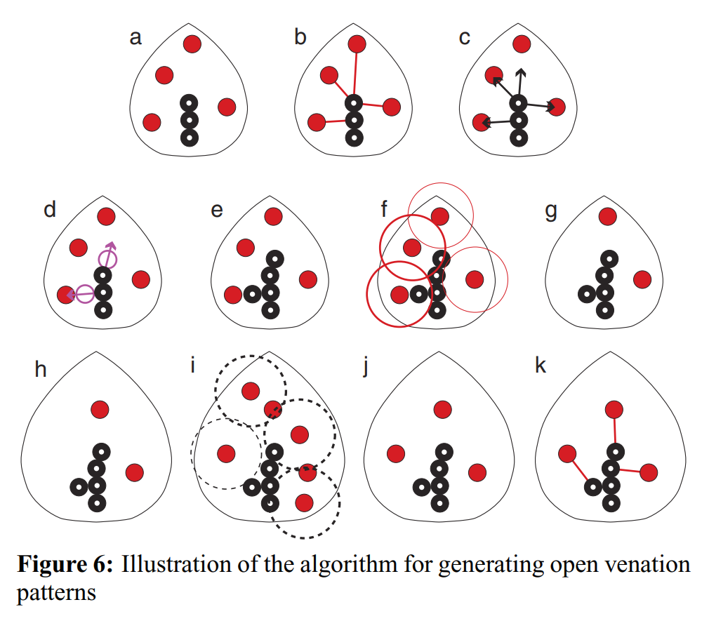

A Python implementation of the leaf venation algorithm.

## Inspiration
This project was inspired by Tsoding, who implemented a similar simulation in C (check out his version [here](https://github.com/tsoding/leaf-venation)). 
I decided to build this in Python just for fun, without looking at his implementation. I am fully aware that my implementation is highly inefficient in several areas, but it serves its purpose as an exploratory project.

## Algorithm Reference
<div style="min-height: 160px; margin-bottom: 20px;">
  
  <p>The algorithm follows the description in the paper: <a href="https://dl.acm.org/doi/10.1145/1186822.1073251">Modeling and Visualization of Leaf Venation Patterns</a> (Section "3.4 Example").</p>
  <p>A local copy of the PDF is available in <code>docs/modeling_and_visualization_of_leaf_venation_patterns.pdf</code>.</p>
</div>
<br clear="left">

### Top-Left Starting Position
<table align="center">
  <tr>
    <td align="center" width="50%">
      <b>Auxin Collision Radius 5x</b><br>
      <video src="https://github.com/user-attachments/assets/b0d47969-f37c-4e2f-b254-fcf1e46c325b" width="100%" controls></video>
    </td>
    <td align="center" width="50%">
      <b>Auxin Collision Radius 20x</b><br>
      <video src="https://github.com/user-attachments/assets/0ae6ad61-fd96-4abb-9706-370b5e032338" width="100%" controls></video>
    </td>
  </tr>
</table>

### Center Starting Position
<table align="center">
  <tr>
    <td align="center" width="50%">
      <b>Auxin Collision Radius 5x</b><br>
      <video src="https://github.com/user-attachments/assets/30c79c9f-2a6b-44c1-a23f-cb40e1a7b5a1" width="100%" controls></video>
    </td>
    <td align="center" width="50%">
      <b>Auxin Collision Radius 20x</b><br>
      <video src="https://github.com/user-attachments/assets/b42166cd-cc77-4b0a-bdf5-87ae333998ee" width="100%" controls></video>
    </td>
  </tr>
</table>

## Prerequisites & Usage

Ensure you have [uv](https://github.com/astral-sh/uv) installed. You can run the project directly with:

```bash
uv run main.py
```

You can stop the execution early by using '**q**'.

By default the simulations runs automatically, in case `AUTO_MODE` is set to `False` then *SPACEBAR* can be used to step forward the simulation.
```py
AUTO_MODE = True
FPS = 30 
```

